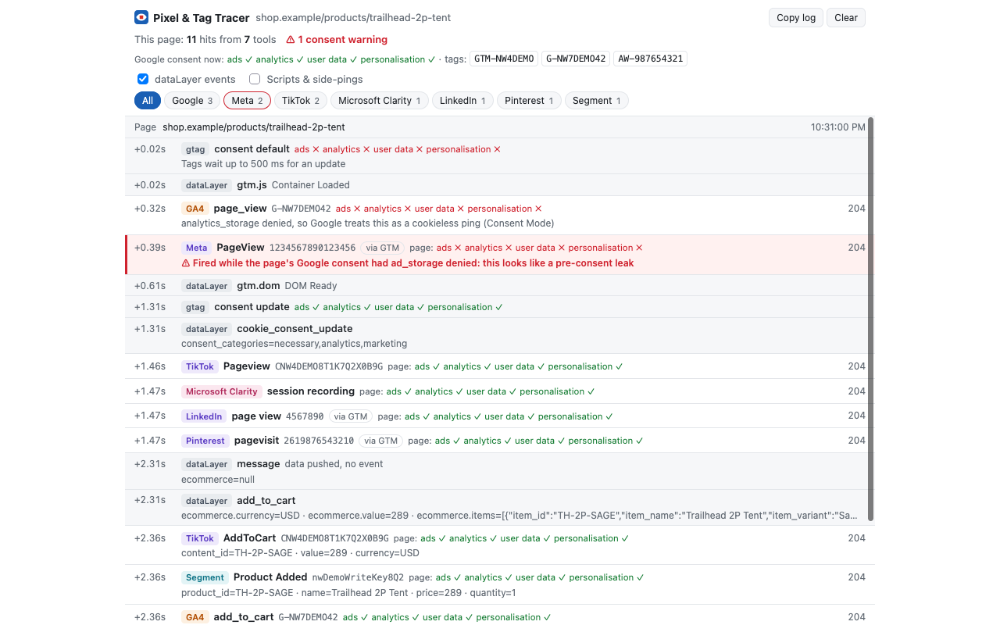

# Pixel & Tag Tracer

A Firefox extension for anyone who needs to know what a website's tracking is
really doing. It shows every hit a page sends to 57 ad, analytics,
session-replay, CDP and marketing tools: the event, the IDs it went to, every
parameter, the consent state it fired under, and the GTM events behind it.

Built for marketers, analysts and developers auditing tags, checking a cookie
banner, or debugging Google Tag Manager. Everything stays in your browser.

## What it catches

**Google** (GA4, Universal Analytics, Google Ads, Floodlight, GTM, plus
server-side GTM and Google tag gateways on the site's own domain), **Meta**,
**Segment**, and:

| Group | Tools |
|---|---|
| Ad pixels | TikTok, LinkedIn, Microsoft Ads (UET), Pinterest, Snapchat, X, Reddit, Quora, Spotify, Amazon Ads, Criteo, The Trade Desk, StackAdapt, AdRoll, RTB House, AppLovin, Taboola, Outbrain, Xandr, Quantcast, Adobe Advertising |
| Analytics | Adobe Analytics and Web SDK (incl. first-party domains), Amplitude, Mixpanel, Heap, PostHog, Matomo, Plausible, Fathom, Comscore |
| Session replay | Hotjar, Microsoft Clarity, FullStory, Contentsquare, Quantum Metric, Mouseflow, Crazy Egg |
| CDPs and tag managers | RudderStack (incl. proxied), mParticle, Tealium |
| Marketing automation | HubSpot, Marketo, Marketo Measure (Bizible), Pardot, Klaviyo, Attentive, Impact, Northbeam, Customer.io |
| B2B intent and reveal | 6sense, Demandbase, ZoomInfo, Clearbit, G2 |

Every endpoint and payload format was taken from real traffic on live sites
(October 2026), not from docs. For most tools it decodes the event name, the
account or pixel ID, and the event's properties. A few (Attentive, Northbeam,
Adobe Advertising) are recognised but not decoded: their scripts and requests
show, so you can see they're on the page.

Each row also flags what's worth knowing in an audit: advanced matching that
sends hashed emails (Meta, TikTok), traits sent unhashed (Segment, mParticle,
Klaviyo), tools that look up the visitor's company from their IP address
(6sense, Demandbase, ZoomInfo, Clearbit), HubSpot capturing the site's own form
submissions, session recordings, and tracking routed through the site's own
domain.

### Debugging GTM

Alongside the hits, the timeline shows every `dataLayer` push and `gtag()`
call on the page, in order. That covers:

- **GTM's built-in events**, named as Tag Assistant names them: Consent
  Initialization, Container Loaded, DOM Ready, Window Loaded, Click, Link
  Click, Form Submit, History Change, Scroll Depth, Timer and so on.
- **Custom events and plain data pushes.** A push with no event shows as
  "message", as Tag Assistant does.
- **gtag commands:** `config`, `event`, `set`, and `consent default` /
  `consent update` with consent chips, including which regions a default
  applies to.

So you can read straight down: the push, then the pixels it fired. Click a
dataLayer row for its full payload (DOM elements show as `<a#id.class>`) and
**Copy JSON**. Renamed dataLayers (`gtm.js?l=…`) are watched too. Untick
*dataLayer events* to hide them.

**dataLayer snapshots**, like the Data Layer tab in GTM's Tag Assistant:

- On any dataLayer row, **dataLayer after this push** shows the merged state at
  that point: everything pushed on the page so far, combined the way GTM
  combines it. Nested objects merge, arrays and values replace, `null` clears
  and `_clear: true` replaces.
- On any hit, **dataLayer when it fired** shows what GTM knew at the moment
  that request went out: the values a tag could read.

Pixels that say in their own request that GTM installed them get a **via GTM**
label: Meta, LinkedIn, Microsoft, Snapchat, X, Quora, Pinterest, Amazon,
Taboola and Clarity. The header lists the GTM containers and Google tag IDs
live on the page (GTM-…, G-…, AW-…).

What it can't show is your GTM tag *names*: published containers don't carry
them. For those, use GTM's Preview mode (Tag Assistant) alongside it.

### Consent

For every Google hit it decodes Consent Mode from `gcs`/`gcd`: each of ads,
analytics, user data and personalisation, and *how* it got there (e.g. "denied
by default, granted by update"). Microsoft's UET carries its own consent flag
(`asc`), which is decoded too.

Other tools carry no consent signal. So when one fires, the extension checks
what the page's consent state is at that moment. It reads gtag's live Consent
Mode state, which every major banner (OneTrust, Cookiebot, CookieYes and the
rest) feeds when it's wired up for Consent Mode. It also reads the
CookieConsent library's `cc_cookie` if the site uses it.

- **Ad pixels, B2B intent tools, Attentive, Impact and Northbeam** are flagged
  if they fire while `ad_storage` is denied.
- **Analytics, session replay, CDPs and marketing automation** (HubSpot,
  Marketo, Pardot, Klaviyo, Customer.io) are flagged if they fire while
  `analytics_storage` is denied. Segment events that carry Segment's own consent
  stamp aren't flagged, because Segment routes those by the stamp.

Flagged rows go red, and so do the toolbar badge and that tool's chip.

Each row also shows the response status, so a pixel blocked by Firefox's
tracking protection or another extension is visible instead of silently missing.

## Install

Install **Pixel & Tag Tracer** from Firefox Add-ons (addons.mozilla.org).
It needs Firefox 140 or later.

## Use

- **Toolbar button:** the log for the current tab. The badge counts this page's hits.
- **Tool chips** across the top list every tool seen in the tab, busiest first,
  with its hit count. A tool that only loaded scripts shows 0. Click one to
  see just that tool.
- **Sidebar:** click *Sidebar* in the popup. It stays open while you click
  around and follows whichever tab you're on. This is the view for testing a
  cookie banner: click *Accept* and see what fires.
- **Lock to this tab** (in the sidebar) keeps it showing one tab while you
  work in others, say the client site while you're in GTM or GA4. Click it
  again to follow the active tab; closing the locked tab unlocks it.
- **Tag Tracer in DevTools:** the same view as a DevTools panel. DevTools
  belongs to one tab, so the panel is only there on the tabs you open it on;
  flick to another tab and it's gone, flick back and it's still open. Open
  DevTools (F12, or Cmd+Option+I on a Mac), pick the *Tag Tracer* tab, and dock
  DevTools to the right (••• menu → *Dock to Right*) to use it like a sidebar
  for that tab only. It shows everything logged on the tab, including hits
  from before DevTools was opened. (Firefox's own sidebar can't do this: it
  belongs to the window, and add-ons may only open or close it on a click.)
- **Click a row** for every parameter with a plain-English label, and the raw URL.
- **Click to copy:** any ID (GTM-…, G-…, pixel IDs, write keys, the tag IDs in
  the header) and any key or value in a table. **Copy table** copies a whole
  table as tab-separated text, ready to paste into a spreadsheet. Dragging to
  select part of a value works too; the list holds still while you select.
- **Copy log** puts the visible log on the clipboard as plain text, ready to
  paste into an audit, a ticket or a chat.

The log keeps going across page loads, with a divider per page, so a
first-visit, then accept, then next-page flow reads top to bottom. *Clear* empties it.

### Testing a site's consent setup

- Use a **private window** to see a first visit with no consent cookie. Allow
  the extension there first (Add-ons → Pixel & Tag Tracer → *Run in Private Windows*).
- Firefox blocks trackers in private windows by default, so pixels show as
  *blocked by Firefox tracking protection*. Turn it off for the site with the
  shield icon in the address bar to see what the site itself would send.
- To check Global Privacy Control handling, set
  `privacy.globalprivacycontrol.enabled` to `true` in `about:config`. The header
  shows *GPC on* when the page can see it.
- Watch the header's *Google consent now* line while you use the banner. It
  shows what the site has told Google, whatever the banner claims.

## Privacy

The extension sends nothing anywhere: no analytics, no accounts, no network
requests of its own. Everything it shows is held in memory in your browser and
goes when Firefox closes. It doesn't block or change any request a page makes.

To do its job it needs access to every site. It reads requests as they leave
the browser, and it reads each page's `dataLayer` and consent state. It wraps
`dataLayer.push` only to time events exactly, and passes every call straight
through.

## Limits

- It sees what the **browser** sends. Server-side calls (Meta Conversions API,
  GA4 Measurement Protocol, Segment server sources, server-side GTM's onward
  requests) never touch the browser and won't appear.
- A tool proxied through a site's own domain is only recognised where its
  requests are distinctive: Google tag gateways and server-side GTM, Adobe,
  Matomo, Plausible and RudderStack are; Segment, PostHog and most others are
  only recognised on their own hosts.
- Tools not in the list above don't appear.
- The leak flags rely on the site using Google Consent Mode (or `cc_cookie`).
  On a site with neither, nothing is flagged, and the detail view says so.
- The live consent read uses `google_tag_data.ics`, gtag's internal state.
  It's what Google's own debugging tools read, but it isn't a public API. If
  Google changes it, the per-hit `gcs`/`gcd` decoding still works.
- Logs live in memory and go when Firefox restarts. The last 1,000 entries per tab are kept.

## Development

Load it unpacked: open `about:debugging#/runtime/this-firefox`, click
*Load Temporary Add-on…* and pick `manifest.json`. It stays until Firefox quits.

Run the tests (no dependencies): `node tests/run.js`.

Real-Firefox checks run the extension on a made-up shop
(`docs/screenshots/demo-shop.html`) behind a local proxy, so nothing reaches a
real vendor: `cd tests/firefox && npm install && node run.mjs consent` (or
`popup`, `sidebar`, `copy`, `devtools`). Each test page in
`tests/firefox/pages/` reports PASS/FAIL lines. The `devtools` check runs the
panel with the APIs a DevTools panel doesn't get removed; it can't open real
DevTools in headless Firefox. `node run.mjs live <url> …` visits real sites
directly, one after another, and reports what was recorded on each.

- `rules.js` handles Google, Meta and Segment in full, decodes consent, labels
  parameters, and holds the vendor registry. It's pure functions, shared by the
  background page and the panel.
- `vendors.js` has one entry per other tool: hosts, how to read its requests,
  which consent signal it needs. Adding a tool is one entry here.
- `content.js` runs in each page's top frame and reports dataLayer pushes.
- `probe.js` is injected on demand to read the page's consent state and tags.
- `devtools.html` / `devtools.js` add the *Tag Tracer* DevTools panel (the same
  `panel.html`, which asks the background page for tab details, because
  DevTools panels get no tabs API).
- `background.js` holds the request listeners, per-tab logs and the badge.
- `panel.html`, `panel.css` and `panel.js` make up one page that serves the popup, the sidebar and `panel.html?tab=<id>`.
- `tests/run.js` holds the tests. The vendor cases are real requests captured from live sites.

To package a build: `npx web-ext build --ignore-files tests docs "tests/**" "docs/**"`.
Bump `version` in `manifest.json` for each release, and keep the add-on `id`
as it is so installs update in place.

## Feedback and bugs

Report a problem, or ask for a tool to be added, in
[GitHub Issues](https://github.com/Fortnight-Digital/pixel-and-tag-tracer/issues). For a tool that's missing or misread, *Copy log*
on the page in question and paste it in, after checking it for anything
private: the log holds the page's URLs and every parameter sent.

## Licence

MIT. See [LICENSE](LICENSE).
